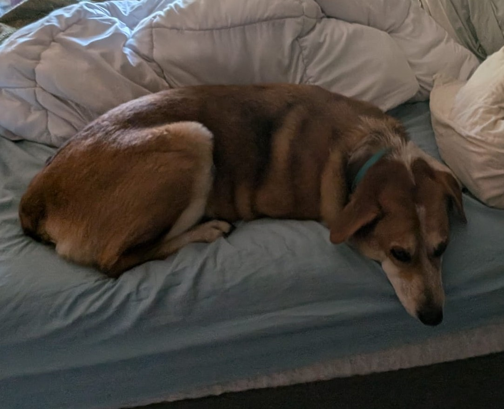

## Timur Ergin Babakol

### Formal Background

My current research focuses on energy characterization of applications. As applications are a very modular class of programs, there is a need to decompose them into logical units. While the definition of a logical unit is somewhat subjective, we need to start somewhere. My work takes domain knowledge about applications and the systems they run on, and reduces the representation to something humans can reason about. Please refer to my ramblings in this slide deck for some background on the challenges surrounding these problems.

### Casual Background

I enjoy drawing pictures and building machines, and trying to understand how my decisions impact then. Fundamentally, I enjoy thinking about how things work and how we can reduce things to simple ideas. As a result, I like writing code for fun. In the words of [John Ousterhout](https://web.stanford.edu/~ouster/cgi-bin/book.php):

```
Writing computer software is one of the purest creative activities in the history of the human race. Programmers aren't bound by practical limitations such as the laws of physics; we can create exciting virtual worlds with behaviors that could nevre exist in the real world.
```

Programming is fun because we can make up the rules. [Satoru Iwata](https://en.wikipedia.org/wiki/Satoru_Iwata#Early_life) was able to create sufficient complicated games with programming calculator. In the same way, I like to make things that make systems do strange things.

### Points of contact (In order of likelihood of a response)
 - This git account
 - mailto:tbabako1@binghamton.edu
 - Anything listed here: https://orcid.org/0009-0003-5476-1518

If you find me through another channel, there's a low chance I will respond over it.

### Current Work

 - [jcarbon](https://github.com/project-jcarbon/jcarbon): A multi-grained energy accounting system for Linux server applications

### Publications

Timur Babakol, Yu David Liu, [Tensor-Aware Energy Accounting](./docs/publications/smaragdine-ICSE24.pdf), ICSE, 2024.

Timur Babakol, Anthony Canino, Yu David Liu, [Eflect: Porting Energy-Aware Applications to Shared Environments](./docs/publications/eflect-ICSE22.pdf), ICSE, 2022.

Timur Babakol, Anthony Canino, Khaled Mahmoud, Rachit Saxena, Yu David Liu, [Calm Energy Accounting for Multithreaded Java Applications](./docs/publications/chappie-FSE20.pdf), FSE, 2020.

### Education

### Trivia
 - I used to play `Magic: the Gathering` competitively when the game was more rooted in paper
 - I like to do gastronomic things like fermentation (though I'm not an amazing cook)
 - I like art, especially drawings, paintings, and photographs. My favorite piece is [Fountain by Marcell Duchamp](https://en.wikipedia.org/wiki/Fountain_(Duchamp)), and I like [Man Ray's photographs](https://www.manray-photo.com/catalog/index.php).
 - I love my dog. Here she is:

